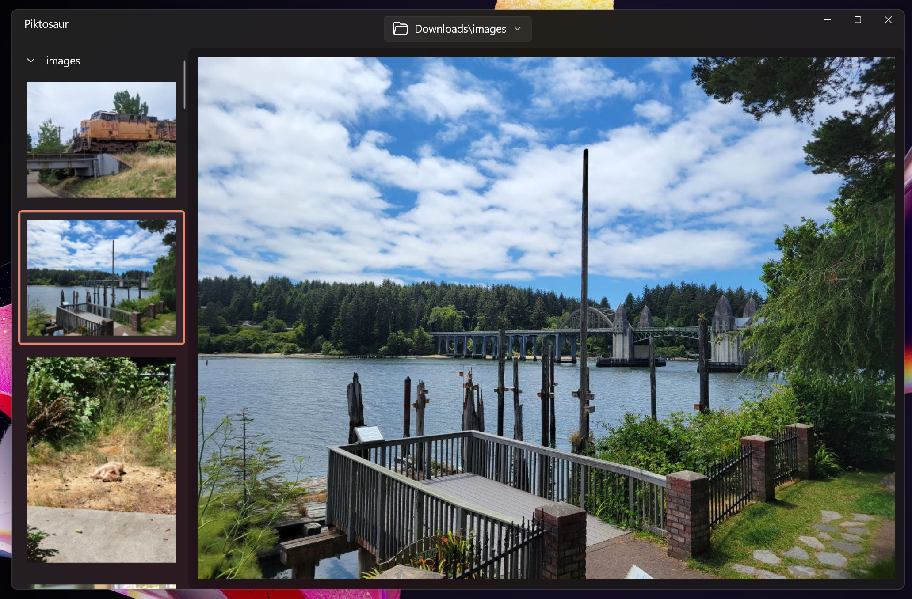

# Piktosaur

This is a Windows application built using WinUI 3 framework. It has a very simple goal: to show you all images in a folder without any distractions. Aside from minimal interface, it searches folders recursively, and if there are images several folders deep (even if folders in between have no images), it will display that folder and images in it.

This way you can just open "Downloads" or "Documents" folder and quickly scroll through all the images you have there.

## Features

Right now, the core functionality of opening any folder and presenting every image in it, generating thumbnails in runtime, and showing all of that using minimal mode is done. There are some additional features I am working on:

- add details mode, which will allow to customize the view and see selected image's metadata and filenames in the list
- add customizing options (like move the list to the bottom/right/top)
- add filtering and sorting options

After I am done with them, I plan to publish this app to the MS Store.